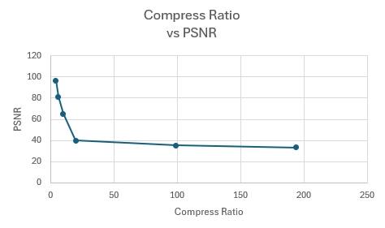

# wpcc: wave point cloud compression
This project leverage the potential of music and wave to store point cloud in a high compression rate and high psnr.  
  
compression ratio:  4.298988436198355   PSNR:  96.65370410720178  
compression ratio:  5.99855451214785    PSNR:  81.36337766963433  
compression ratio:  9.987433534724333   PSNR:  65.16278632253571  
compression ratio:  19.945550399973392  PSNR:  49.8089185313019  
compression ratio:  39.77599787738587   PSNR:  40.131839338341855  
compression ratio:  98.9865749286793    PSNR:  35.39985023588736  
compression ratio:  193.90565417488494  PSNR:  33.25700697845874  
## how to init this project
``` bash  
pip install -r requirements.txt
```
## usage

1. open testcompression.py
1. use this sample code 
    ```python
    pcc = PCcompression(box_size, frame_size, compression_value, visualize, use8bit)
    pcc.pc2mp3(path)
    ```
1. and the compression ratio and PSNR will be printed.
