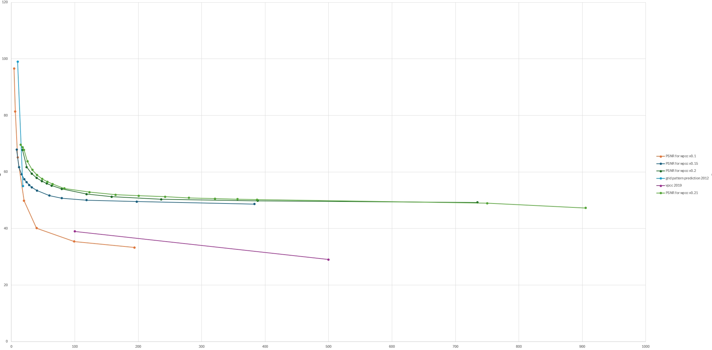

# wpcc: wave point cloud compression
This project leverage the potential of music and wave to store point cloud in a high compression rate and high psnr.  
  
| Compression level |Compression Ratio | PSNR |
|-------------------|------------------|------|
| 1|4.298988436198355 | 96.65370410720178 |
| 3|5.99855451214785  | 81.36337766963433 |
| 5|9.987433534724333 | 65.16278632253571 |
| 10|19.945550399973392| 49.8089185313019  |
| 20|39.77599787738587 | 40.131839338341855|
| 50|98.9865749286793  | 35.39985023588736 |
| 100|193.90565417488494| 33.25700697845874 | 


point cloud comresssion level 1  
compression ratio 4.3


point cloud comresssion level 5  
compression ratio 9.98


## how to init this project
``` bash  
pip install -r requirements.txt
```
## usage

1. open testcompression.py
1. use this sample code 
    ```python
    pcc = PCcompression(box_size, frame_size, compression_value, visualize, use8bit)
    pcc.pc2mp3(path)
    ```
1. and the compression ratio and PSNR will be printed.
